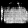

--------------------------------------------------------------------------------
# CS390NIP Lab 4 GANs
--------------------------------------------------------------------------------

Written by Sri Cherukuri, Anthony Niemiec, and Maxwell J. Jacobson.

This code is for CS390NIP: Neural Image Processing at Purdue University.

--------------------------------------------------------------------------------
# Report
--------------------------------------------------------------------------------

Name: Seung Heon Lee

Email: lee3072@purdue.edu

Resources Used: 
* Gan Class Slide Page 10, 12
* https://www.tensorflow.org/tutorials/generative/dcgan

Parts Completed
* Complete the GAN to generate legible F-MNIST records. Generate from 3 classes.
* Use a convnet for the GAN networks.
* Implement the option to select the ratio of training between discriminator and generator.
* Save a plot of loss over training steps for each network.

## Hyperparameters

shirts:
* Learning Rate: 0.002 (Generator)
* Ratio of Training: 0.02 (Discrimiator / Generator)
* Epochs: 9000
* BatchSize: 32 (Both Generator and Discrimiator)

ankle boots:
* Learning Rate: 0.002 (Generator)
* Ratio of Training: 0.003 (Discrimiator / Generator)
* Epochs: 9000
* BatchSize: 32 (Both Generator and Discrimiator)

bag:
* Learning Rate: 0.002 (Generator)
* Ratio of Training: 0.0054 (Discrimiator / Generator)
* Epochs: 10000
* BatchSize: 32 (Both Generator and Discrimiator)

Activation function hidden layers: LeakyReLU (Both Generator and Discrimiator)

Dropout Rate: 0.3 (Discriminator)

Activation function last: sigmoid (Discriminator) 
* NOTE: sigmoid to adjust output range to 0 to 1, which is possiblity of image being true

Activation function last: tanh (Generator) 
* NOTE: tanh to adjust output range to -1 to 1, which is pixel value range

Optimization Algorithm: Adam (Both Generator and Discrimiator)

Loss Function: binary_crossentropy (Both Generator and Discrimiator)

## Loss Plots:

\
shirt:\

\
ankle boot:\

\
bag:\

## Generated Images:

shirt final ouputs:

ankle boot final ouputs:

bag final ouputs:

--------------------------------------------------------------------------------